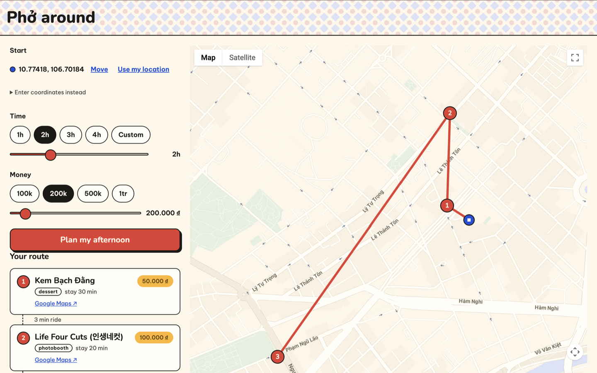

# Phở around 🍜

**Tell it where you are in Sài Gòn, how much time you have, and your budget — get back an
optimized outing: which spots, in what order, with honest travel times.**

Most "where to eat" apps are searchable lists. Phở around treats an afternoon out as an
**optimization problem**: it picks a subset of ~100 curated places and orders them into the
best route that fits your time and money — using real Operations Research, not a sorted list.

<!-- Add a screenshot: save an image to docs/screenshot.png and uncomment:

-->

## How it works

1. Tap the map (or use your location) to set a start point, pick a time budget and a spending
   budget.
2. The backend solves an **orienteering problem** — a prize-collecting traveling-salesman
   variant — as a mixed-integer linear program (PuLP + CBC): maximize the total appeal of
   visited places, subject to your time budget (dwell + travel + a realism buffer per stop)
   and your money budget, with MTZ constraints keeping the route a single connected path.
3. The route renders as numbered pins and a path on a custom-styled Google Map, with per-leg
   ride times and a running total — every stop deep-links into Google Maps for photos, hours
   and reviews.

Some details the optimizer gets right that a list never could:

- **Travel time is real.** Place-to-place motorbike times come from a precomputed Routes API
  matrix (`TWO_WHEELER` — this is Sài Gòn); the legs from *your* start point are fetched live
  and traffic-aware on every request. If the API is unreachable, times degrade gracefully to a
  distance formula at 12.6 km/h — not a guess, but the city's measured median riding speed.
- **Routes don't zigzag.** Travel enters the objective as a carefully-sized tiebreaker, so
  among equally-appealing plans the solver always returns the shortest ordering — without
  ever sacrificing a better place to save a minute of riding.
- **It doesn't overpromise.** Every stop is charged a parking/queueing buffer, and the time
  budget is hard — the plan you get is one you can actually live.
- **It scales politely.** Each request pre-filters the dataset to ~40 candidates — the nearest
  places to *your* start plus the city's best wherever they are — keeping solves under a few
  seconds while a far-away gem always keeps its seat at the table.

## The data

~100 real Sài Gòn places — phở and bún bò to specialty coffee, photobooths, museums and
landmarks — hand-curated (dwell times, real VND prices, categories are human judgement),
with facts (coordinates, ratings, place ids) resolved through the Geocoding and Places APIs
by a small family of dry-run-first import scripts in [`backend/scripts/`](backend/scripts/).

## Stack

| Layer | Choice |
|---|---|
| Frontend | React + Vite, plain JavaScript, hand-written CSS design system |
| Map | Google Maps JavaScript API (custom cloud style, advanced markers) |
| Backend | FastAPI (Python) |
| Optimizer | PuLP + CBC (mixed-integer linear programming) |
| Travel times | Google Routes API (`computeRouteMatrix`, two-wheeler mode) |
| Data | Curated JSON seed + precomputed sparse travel-time matrix |

## Running locally

Two dev servers, two terminals. You'll need a Google Cloud project with the Maps JavaScript,
Geocoding, Routes and Places APIs enabled, and two API keys (see the `.env.example` files —
a browser key locked by referrer + API restrictions, and a server key kept server-side).

```bash
# backend — http://127.0.0.1:8000
cd backend
python -m venv .venv && source .venv/bin/activate
pip install -r requirements.txt
uvicorn api:app --reload

# frontend — http://localhost:5173
cd frontend
npm install
npm run dev
```

Tests: `python -m pytest` from `backend/` (engine, HTTP layer, travel-time lookup, and the
solver's behaviour pinned by hand-checkable instances).

## Status

The v1 core loop is complete — optimized routes over real data on a designed UI. Public
deployment is next; then saved itineraries, richer data sync, and an LLM planning layer.

---

*A full-stack learning project, built end-to-end — data modeling, MILP optimization, API
design, React, and a lot of respect for Sài Gòn traffic.*
